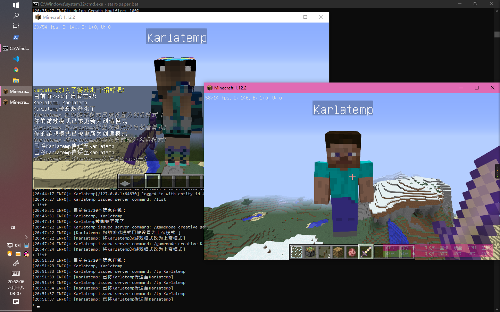

# YggdrasilOfficialProxy v2.0.0

- Power by kotlin.
- Configuration powered by [@SpongePowered/Configure](https://github.com/SpongePowered/Configurate)
- AuthLib Injector by [@yushijinhun/authlib-injector](https://github.com/yushijinhun/authlib-injector/)
- HttpClient powered by [Ktor](http://ktor.io/) 
  & [OkHttp](https://github.com/square/okhttp)

# Downloading
首先, 你需要前往 releases 下载你所需要的对应版本.

我们提供了三个版本:

- minecraft
- paperclip
- proxy

请根据需要使用对应的版本

# Booting
我们提供了三种启动方式, 作为 agent 加载和 作为独立服务器 加载

## Proxy Booting
Proxy Edition, 是以一个独立服务器的方式运行的, 他的好处在于:
- 独立于MC服务器, 方便另外管理
- 重新配置只需要配置一个服务器 (见下文)
- 可以快速重新启动代理服务器而不需要重新启动整个群组

## Agent Booting

Agent Edition, 是以修改 javaagent参数的形式启动的,
代理服务器会随着MC的启动而启动, 随着MC的关闭而关闭
好处在于
- 不需要另外准备服务器或者运行环境
- 同样只需要配置一个服务器
- **特别说明**:
  - YggdrasilOfficialProxy-minecraft.jar 无法工作时请换用 `-paperclip` 版本
  - Spigot服务器无法使用 `YggdrasilOfficialProxy-minecraft.jar` 时请使用 `-paperclip`
    版本并上报相关错误
  - `paperclip` 版本携带了全部用到的依赖库, 大是必然的

# Configuration
在启动 YggdrasilOfficialProxy 的时候,
我们首先会为您生成一个配置文件. 然后服务器会随之关闭
你需要编辑 `YggdrasilOfficialProxy.conf`, 并且最重要的一点
最**重要**的一点, `edited=true`!

## Standard Proxy Server setup
Proxy Edition:

在启动了 Yggdrasil Proxy Server (Proxy Edition) 之后,
你可以看到以下日志

```
[YggdrasilOfficialProxy] Server running on XXXXX:XXXX
```
假设(只是假设!)运行在 `192.168.78.34:30500` 上

假设这是你的启动脚本
```shell script
#
# 如果你是 BungeeCord 群组服务器,
# 那么这是 BungeeCord 的启动脚本
#
# 如果不是, 那么就是独立服务器的启动脚本
#

java -javaagent:authlib-injector.jar=.... ....
```

我们需要将他修改成这样

```shell script
java -javaagent:authlib-injector.jar=http://192.168.78.34:30500 ....
```
然后 `:wq`, 重新启动, 此时启动Authlib-Injector可能会警告
`[authlib-injector.config] [WARNING] You are using HTTP protocol, which is INSECURE! Please switch to HTTPS if possible.`

我们直接选择将其无视掉, 因为目标服务器是我们的内网服务器, 直接安全的无视掉就可以了

## Agent Edition Startup
首先我们需要打开我们的服务器启动脚本

假设(假设!只是假设!)
- 我们的 YggdrasilOfficialProxy AgentEdition 叫做 `YggdrasilOfficialProxy-2.0.0-paperclip.jar`
- 我们的 AuthLib Injector 叫做 `authlib-injector-1.1.26-41a7a47.jar`
- 我们使用的 Yggdrasil API Root 为 `https://skin.prinzeugen.net/api/yggdrasil`

这是我们的启动脚本:
```shell script
#
# 如果你是 BungeeCord 群组服务器,
# 那么这是 BungeeCord 的启动脚本
#
# 如果不是, 那么就是独立服务器的启动脚本
#

java -javaagent:authlib-injector-1.1.26-41a7a47.jar=https://skin.prinzeugen.net/api/yggdrasil ....
```
然后, 我们需要直接把原来的 `-javaagent:authlib-injector-1.1.26-41a7a47.jar=https://skin.prinzeugen.net/api/yggdrasil` 删掉.
对,删掉, 一点都不要留, 然后换上我们的配置
```shell script
java -javaagent:YggdrasilOfficialProxy-2.0.0-paperclip.jar ....
```
然后直接启动服务器, 对, 直接启动服务器, 我们需要生成 YggdrasilOfficialProxy 的服务器,
如果你写了自动重启, 记得, 在第一次启动后, 关掉. 虽然不关也没问题.

然后打开我们的配置. 修改
```hocon
# API Root, 将这里改成原来的 API Root！
api="https://skin.prinzeugen.net/api/yggdrasil"
# Authlib Injector的位置, 无效的话服务器将无法启动
authlib-injector="authlib-injector-1.1.26-41a7a47.jar"
# 重要! 重要!, 必须为 true!
edited=true
# 在合并玩家查找的时候, 是否优先使用正版服务器的内容
official-first=false
# 代理服务器的设置
server {
    # 换成 127.0.0.1
    host="127.0.0.1"
    # 随便写, 随便写一个没有被占用的端口
    port=32217
}
# Proxy settings
proxy {
    just-example-for-http {
        type=http
        url="http://localhost/proxy"
    }
    # The proxy of official connecting
    official {
        host=localhost
        port=1080
        # type=socks
        type=direct
    }
    # The proxy of yggdrasil connecting
    yggdrasil {
        type=direct
    }
}
```
在全部工作完成之后, 输入 `:wq`, 完成我们的配置吧!

# 特别说明

根据 Minecraft Server, 只要UUID不一样, name一样服务器都会允许玩家加入游戏,
原本 Minecraft 的 Name 是不可能重复的, 但是, 但是! YggdrasilOfficialProxy!
打破了这个限制! 由于 YggdrasilOfficialProxy 的工作方式是替换 Mojang 的 hasJoined.
所以！ 你可能会遇到这种奇葩情况！



两个分别来自正版/第三方验证服务器的同名玩家,
同时加到了一个服务器里! 而且服务器还觉得没什么奇怪的!

所以！所以！你需要自己写一个插件! 保证，不会出现两个一样名字的玩家!
这点非常重要！
